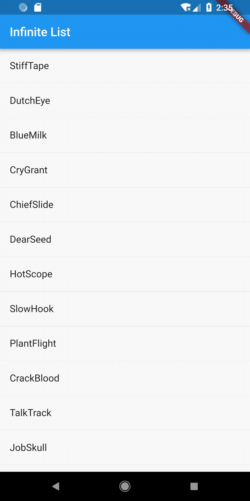
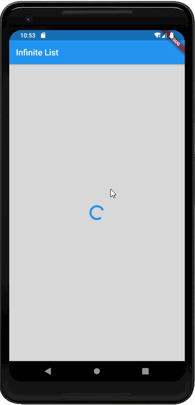

# infinite_list

A infinite list demo

## Demo

### 第一种实现方式（InfiniteListView.dart）

1. 通过在最后添加一个loading的标记，显示加载图标



### 第二种实现方式（InfiniteLIstView2.dart）

1. 通过添加`ScrollController _controller`，并对`_controller`添加监听器，监听滚动的位置，当到达最底部的时候，显示加载指示器

2. 遮罩层：
```dart
Container(
    constraints: BoxConstraints.expand(),
    decoration: BoxDecoration(
        color: Colors.black12,
    ),
    padding: const EdgeInsets.all(16),
    alignment: Alignment.center,
    child: /* SizedBox(
           width: 30,
           height: 30,
           child: CircularProgressIndicator(
               strokeWidth: 5,
           ) */,
	),
),
```

   

